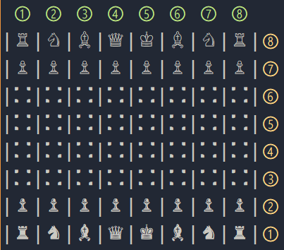

# A Game of Chess #

This was the [final assignment](https://www.theodinproject.com/courses/ruby-programming/lessons/ruby-final-project "Go To Project Page") of [The Odin Project](https://www.theodinproject.com) module for Ruby.

To start a game first your must clone or download the repo to your choosen folder and inside it and simply run: `ruby script.rb`.

### How to Play ###
If you want to learn or need a refresher about chess rules, Wikipedia has an [awesome article](https://en.wikipedia.org/wiki/Chess "Go To Rules") about the game.

You only need to provide the start and destiantion coordinates and the game will do the rest.

> To specify a coordiante you use 2 numbers, first for the rank (y axis) and then the file (x axis). For example, white right knight is at 17 and can move to 36 or 38.

The game has an autosave feature so you will always have the option to continue a game, so don't worry about losing progress if you close the program.

#### To-Do ####
Currently the game has no game ending condition other than being unable to move anywhere once you are in a checkmate.

* add Checkmate
* add Draw
* add Stalemate 

Other planned improvements:

* add option to show game board
* add option to show player current pieces
* improve representation of game board
---
Let me know if you have any comments or suggestions.